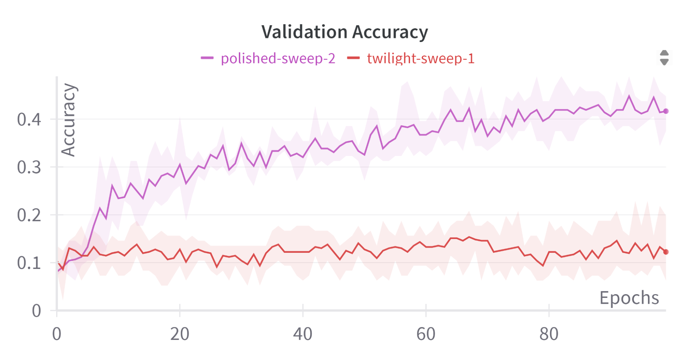
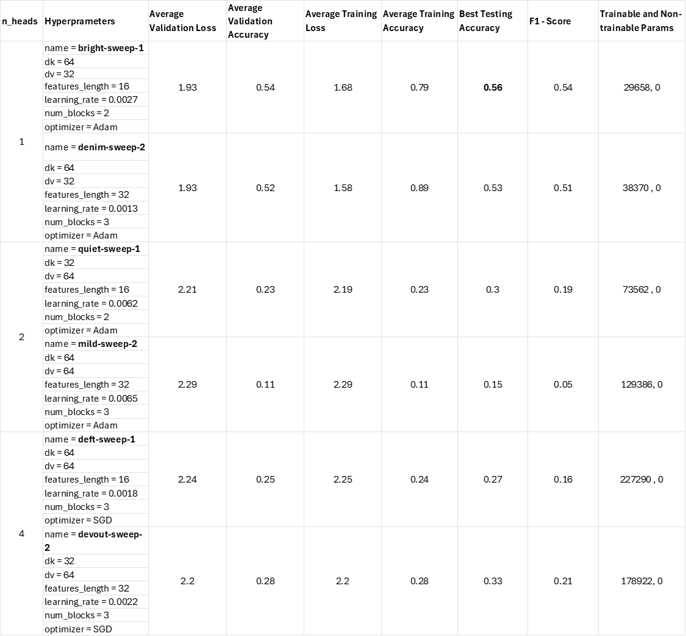
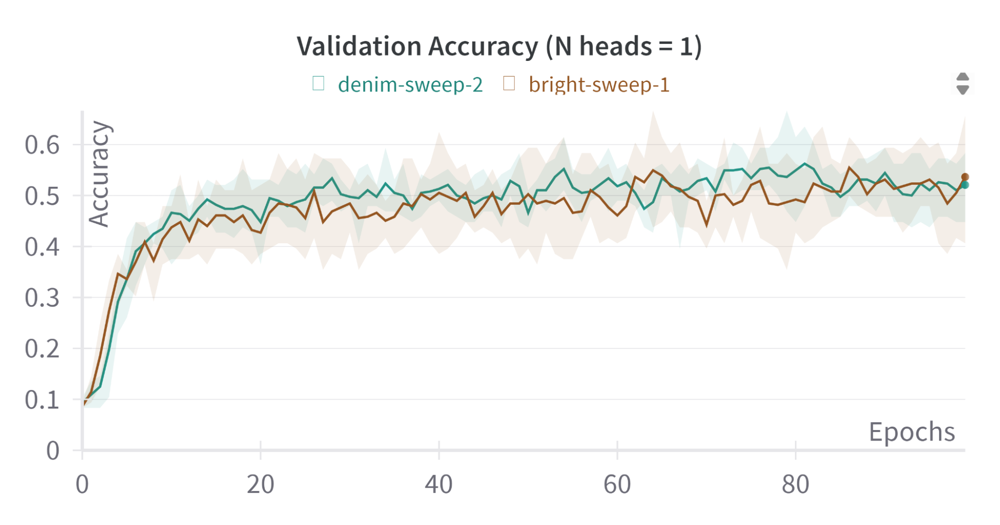
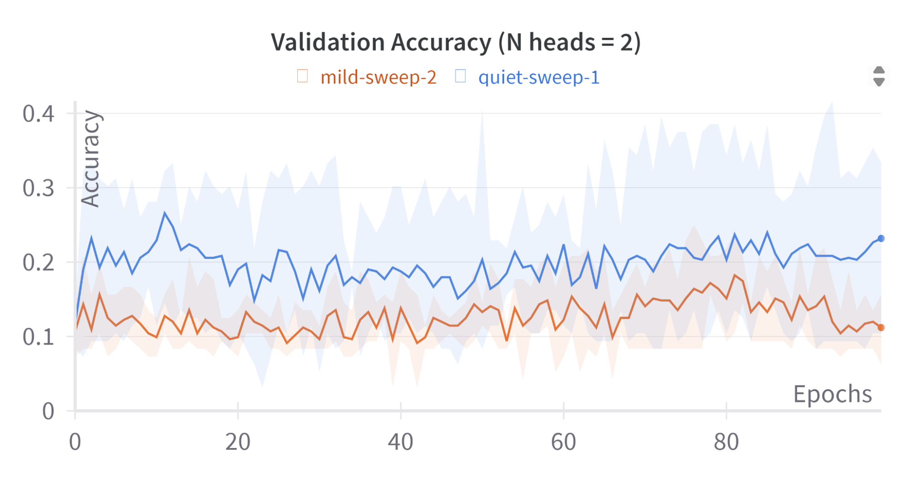

# DL Assignment 2

> Alli Khadga Jyoth - M23CSA003

### Link : [M23CSA003.ipynb](https://www.google.com/url?q=https://colab.research.google.com/drive/1MP7EKCYzYoPvFX9YYOQbUbq93W6kf5Yp?usp%3Dsharing&sa=D&source=editors&ust=1719122579842365&usg=AOvVaw3G1tLlRDS2Zmtf2wriqNer)

Wandb Link: [DL Assignment 2 Runs](https://www.google.com/url?q=https://wandb.ai/khadgaa/projects&sa=D&source=editors&ust=1719122579842669&usg=AOvVaw1dLYnAYMGJBOMdTcu8jtwA)

## Dataset
=======

This is a dataset containing 400 data points of sounds generated by different things. Our aim is to classify these data points using CNN models and Transformer architecture and compare the performance.

The dataset is divided into 5 folds, the first of which is used for testing, and the remaining folds for 4-fold validation.

        Example sample : Crackling\_fire

## Experiment Details
==================

We define two models, a CNN architecture and a Transformer model, to classify the sound samples into 10 different classes. The individual implementation details are given in further sections. The training is done for 100 epochs.

### Hyperparameter tuning:
----------------------

The model hyperparameters are trained using a random search, and the best hyperparameters are selected based on the "average validation accuracy" of the 4-fold validation. Then, the best test accuracy is reported as the best testing accuracy we observed during the 4-fold validation. The hyperparameter sweeps are reported differently for different models in their respective sections.

Architecture 1:
===============

The CNN model contains 4 convolution layers, combined with max pooling and an adaptive-average pooling layer at the output layer. The model architecture is given below. The hyperparameter sweep configuration is reported in table1, along with the best test accuracy. From the table it is shown that the best hyperparameters are achieved from the sweep: “polished-sweep-2”. The plots for 4-fold validation are given in the figures below.

Run Link : [DL\_A2\_Arch1 Workspace – Weights & Biases (wandb.ai)](https://www.google.com/url?q=https://wandb.ai/khadgaa/DL_A2_Arch1/workspace?workspace%3Duser-khadgaa&sa=D&source=editors&ust=1719122579843598&usg=AOvVaw3n8KqondmLS8I5MovhA8Vs)

Table1: Hyperparameter sweep for CNN Architecture

* * *

  
  

  

* * *

## Architecture 2:
===============

For this model we use a CNN feature extractor combined with a Transformer encoder to generate latent representations of the input which are stored in the <CLS> token to classify the input sound samples. The architecture is shown below. For this experiment we are required to report results with 1, 2, 4 number of heads in the multi-head attention block in the transformer encoder. The hyperparameter tuning and results are shown in the table2. With the accuracy, ROC, Confusion matrix following it. We get the best results for the sweep configuration “bright-sweep-1”, which contains 1 heads combined with 2 encoder blocks and other hyperparameters.

Runs Link : [DL\_A2\_Arch2\_cls\_final Workspace – Weights & Biases (wandb.ai)](https://www.google.com/url?q=https://wandb.ai/khadgaa/DL_A2_Arch2_cls_final/workspace?workspace%3Duser-khadgaa&sa=D&source=editors&ust=1719122579845428&usg=AOvVaw2juHx50PSxRUUVUL-Bqlsi)

Table 2: Hyperparameter Sweep for Transformer Architecture

   

   

  

 

Confusion Matrix and AUC-ROC Curve : N Heads  = 1

* * *

Confusion Matrix and AUC-ROC Curve : N Heads  = 2

* * *

Confusion Matrix and AUC-ROC Curve : N Heads  = 4

* * *

## Results:
========

Comparing the results from both CNN architecture and Transformer architecture, 48% and 56% respectively, we see a difference of ~8%, this difference can be attributed to the attention mechanism of the Transformer model. Since we compare the number of parameters of CNN (~1.06M) vs the Transformer (~30K), we see a ~33x difference.  

### For CNN Architecture:
---------------------

*   The model “polished-sweep-2” with Dropout=0.4, Fc\_size=128, Learning\_rate=0.0076, and optimizer=SGD performed better in terms of Average Validation Accuracy, Average Training Accuracy, Best Testing Accuracy and F1-Score compared to “twilight-sweep1”.
*   Despite having more trainable parameters, “twilight-sweep1” performed poorly in all metrics compared to “polished-sweep-2”.

### For Transformer Architecture:
-----------------------------

*   The model “bright-sweep-1” with 1 head and Adam optimizer outperformed other models in terms of Average Validation Accuracy, Average Training Accuracy, Best Testing Accuracy and F1-Score.
*   Increasing the number of heads from 1 to 4 did not necessarily lead to better performance.
*   Models with SGD as the optimizer (“deft-sweep-1”, “devout-sweep-2”) had relatively lower performance metrics compared to those using Adam.
*   The model with the lowest learning rate (0.0013) achieved higher training accuracy.